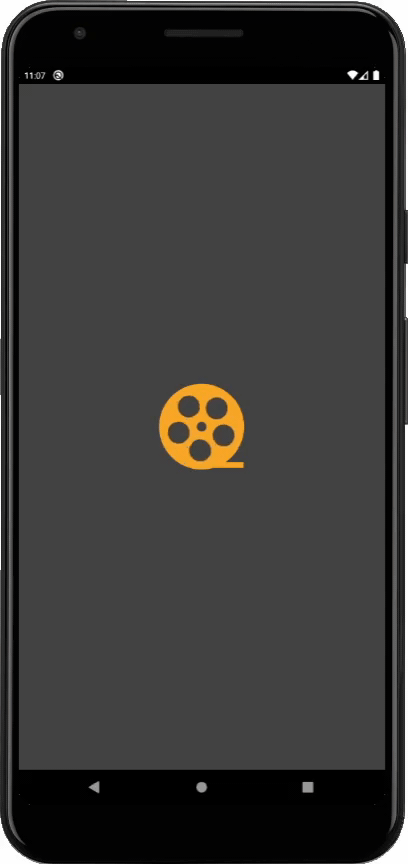
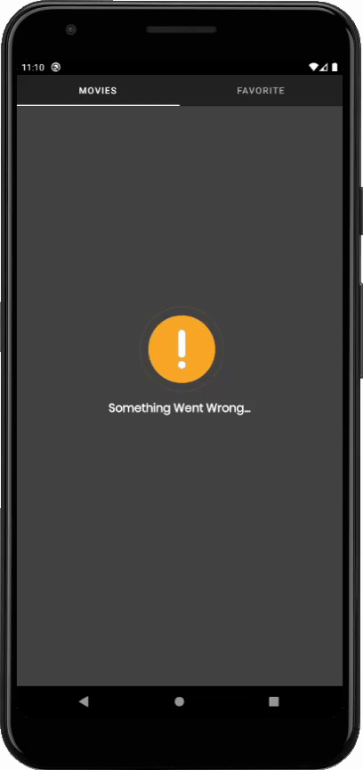
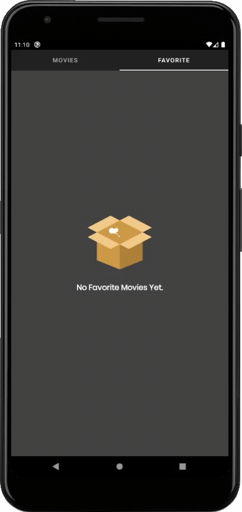
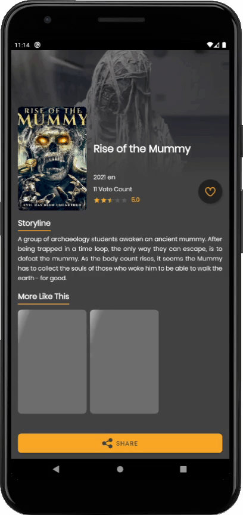

<h1 align="center">
  Capstone Project : Movie App
</h1>
<p align="center">
  Android Expert in Dicoding Course.
</p>
<p align="center">
  <a href="http://developer.android.com/index.html"></a>
  <a href="http://kotlinlang.org"></a>
  <a href="https://developer.android.com/studio/releases/gradle-plugin"></a>
  <a href="https://circleci.com/gh/rizriana/AndroidExpertCapstoneProject"></a>
</p>

## Table of Contents
- [Introduction](#Introduction)
- [Demo App](#Demo-App)
- [Installation](#Installation)
- [Features](#Features)
- [Tech Stack](#Tech-Stack)
- [Dependencies](#Dependencies)

## Introduction

This project is actually just a simple project, This project was created to meet the requirements for submission of the coded android expert class.
There are several branches, but the 'master' branch is the latest update. I'm using (https://www.themoviedb.org/) as a base url for this project.

You can get the API_KEY at (https://developers.themoviedb.org/3)

## Demo App
<h3 align="center"> Splash Screen </h3>
<p align="center">
  
</p>

<h3 align="center"> Movies Screen </h3>
<p align="center">
  
  
  
</p>

<h3 align="center"> Favorite Screen </h3>
<p align="center">
  
  
</p>

<h3 align="center"> Detail Screen </h3>
<p align="center">
  
  
</p>

## Installation 
Clone this repository    
```
    https://github.com/rizriana/AndroidExpertCapstoneProject.git
```    
> This repository has 3 branch
> 1. Master - combination of branches 2 and 3
> 2. Project Latest - contains tasks from project_without_obfuscate
> 3. Project Without Obfuscation - Just "Project Latest" without obfuscation

## Features
- Get All the Movies
- Favorite Movies
- Share the Movies to other Application

## Tech Stack
- MVVM (Model-View-ViewModel) Architecture Pattern
- Modularization (core module)
- Dynamic Feature (favorite module)
- Clean Architecture (data, domain, presentation)
- Dependency Injection with Koin
- Coroutines Flow
- ViewBinding
- DataBinding
- Room Persistence
- Obfuscation with Proguard
- Encryption with SQLCipher
- Certificate Pinning with OkHttp
- Continuous Integration with Circle-CI

## Dependencies
- [CircleImageView](https://github.com/hdodenhof/CircleImageView)
- [ShimmerRecyclerView](https://github.com/omtodkar/ShimmerRecyclerView)
- [Timber](https://github.com/JakeWharton/timber)
- [Glide](https://github.com/bumptech/glide)
- [Lottie](https://github.com/airbnb/lottie-android)
- [Shimmer](https://github.com/facebook/shimmer-android)
- [AndroidX](https://mvnrepository.com/artifact/androidx)
- [Lifecycle & LiveData](https://developer.android.com/jetpack/androidx/releases/lifecycle)
- [Koin](https://github.com/InsertKoinIO/koin)
- [Retrofit](https://square.github.io/retrofit/)
- [Coroutines Flow](https://developer.android.com/kotlin/flow)
- [Room](https://developer.android.com/training/data-storage/room?gclid=Cj0KCQiA0MD_BRCTARIsADXoopYlw1cozWjwyR-ucLYa-aoqYlZeJmxG34JnhByjApMNwuchOcAzcy0aAgGHEALw_wcB&gclsrc=aw.ds)
- [SQLCipher](https://github.com/sqlcipher/sqlcipher)
- [SQLite](https://developer.android.com/jetpack/androidx/releases/sqlite)
- [Leak Canary](https://github.com/square/leakcanary)
